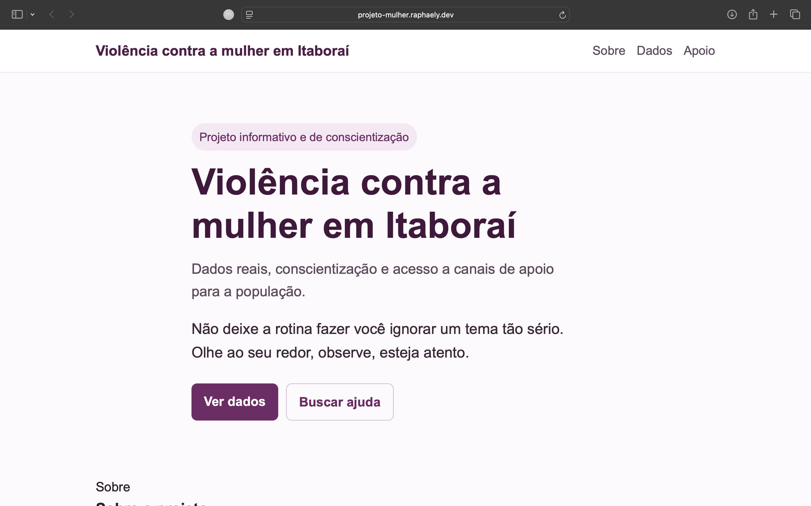

# 🚺 Violência contra a mulher em Itaboraí

Projeto desenvolvido com foco em impacto social, utilizando tecnologia para transformar dados públicos em informação acessível.

🔗 Acesse o projeto:  
👉 https://projeto-mulher.raphaely.dev

---

## 🌐 Preview do projeto

---

## 📊 Sobre o projeto

Este projeto foi desenvolvido com foco no município de Itaboraí (RJ), com o objetivo de apresentar de forma clara e acessível dados relacionados à violência contra a mulher.

A proposta surgiu da necessidade de transformar dados públicos — muitas vezes difíceis de acessar — em uma visualização simples, compreensível e útil para a população.

Os dados utilizados foram obtidos a partir do Instituto de Segurança Pública do Estado do Rio de Janeiro (ISP-RJ), com base em registros oficiais.

---

## 📈 Visualização dos dados

O projeto apresenta três visualizações principais:

### 🔴 Feminicídio e tentativa de feminicídio

Dados que representam os casos mais graves de violência contra a mulher.

---

### 🟠 Ameaça e estupro

Dados relacionados aos crimes de ameaça e estupro, com base nos registros oficiais do ISP-RJ.

⚠️ Observação: os dados apresentados referem-se ao total de ocorrências registradas, não sendo possível identificar, em todos os casos, o gênero das vítimas. Ainda assim, esses indicadores são relevantes para compreender o cenário geral de violência.

---

### 📊 Visão geral dos crimes

Gráfico consolidado com os principais tipos de violência analisados no projeto.

---

## 📌 Sobre os dados

Os dados utilizados são provenientes do Instituto de Segurança Pública do Estado do Rio de Janeiro (ISP-RJ).

Alguns indicadores, como ameaça e estupro, representam o total de ocorrências registradas e não possuem detalhamento completo sobre o perfil das vítimas em todas as situações.

Por isso, a interpretação dos dados deve ser feita com responsabilidade.

---

## 🛠️ Tecnologias utilizadas

- HTML
- CSS
- JavaScript
- AWS S3 (Static Website Hosting)
- AWS CloudFront (CDN)
- AWS ACM (HTTPS)
- Git & GitHub

---

## 💡 Objetivo

Utilizar a tecnologia como ferramenta de impacto social, tornando dados difíceis de acessar em informação simples e disponível para todos.

---

## ⚠️ Reflexão

Os dados apresentados são alarmantes.

Se essa é a realidade de um único município, o que dizer do estado? Do país?

Precisamos olhar com mais atenção para esses casos e estar atentos ao nosso redor.

---

## 👩‍💻 Autora

Desenvolvido por Raphaely Magalhães