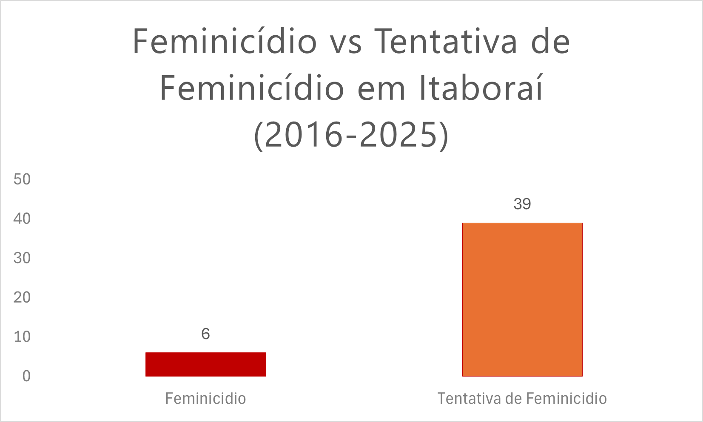
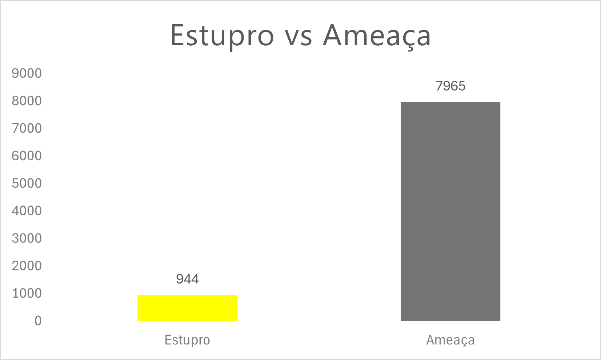
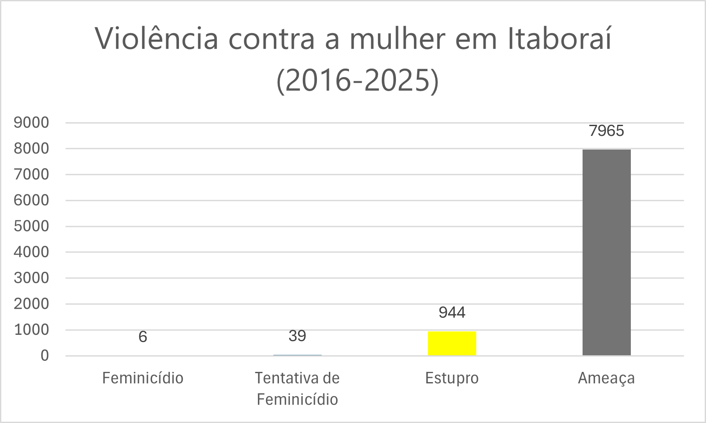

# 🚺 Violência contra a mulher em Itaboraí

Projeto desenvolvido com foco em **impacto social**, utilizando tecnologia para transformar dados públicos em informação acessível.

🔗 Acesse o projeto:  
👉 https://projeto-mulher.raphaely.dev

---

## 🌐 Preview do projeto

---

## 📊 Sobre o projeto

Este projeto foi desenvolvido com foco no município de **Itaboraí (RJ)**, com o objetivo de apresentar de forma clara e acessível dados relacionados à violência contra a mulher.

A proposta surgiu da necessidade de transformar dados públicos — muitas vezes difíceis de acessar — em uma visualização simples, compreensível e útil para a população.

Os dados utilizados foram obtidos a partir do **Instituto de Segurança Pública do Estado do Rio de Janeiro (ISP-RJ)**, com base em registros oficiais.

---

## 📊 Visualização dos dados

### Feminicídio e tentativa de feminicídio

### Ameaça e estupro

### Visão geral dos crimes

---

## 🛠️ Tecnologias utilizadas

- HTML
- CSS
- JavaScript
- AWS S3 (Static Website Hosting)
- AWS CloudFront (CDN global)
- AWS Certificate Manager (HTTPS)
- Namecheap (DNS e domínio)
- Git & GitHub

---

## ☁️ Arquitetura do projeto

O projeto segue uma arquitetura simples em nuvem:

- Front-end estático hospedado no **Amazon S3**
- Distribuição global via **CloudFront**
- HTTPS com certificado gerenciado pelo **ACM**
- Domínio personalizado via **Namecheap**

---

## 🎯 Objetivo

- Facilitar o acesso à informação
- Conscientizar sobre a violência contra a mulher
- Incentivar atenção e cuidado com o que acontece ao nosso redor

---

## 💡 Impacto

Os dados apresentados são **reais e preocupantes**.

Se isso já é a realidade em um município, imagine em escala estadual ou nacional.

A tecnologia aqui foi usada como ferramenta de conscientização.

---

## 🚀 Aprendizados

Durante o desenvolvimento deste projeto, foram aplicados conhecimentos como:

- Hospedagem de site estático na AWS
- Configuração de domínio personalizado
- Distribuição com CDN
- Implementação de HTTPS
- Organização e visualização de dados

---

## 📌 Autora

Desenvolvido por **Raphaely Magalhães**

💻 Estudante de Engenharia de Software  
☁️ Foco em Cloud Computing  

---

## ❤️ Considerações finais

Esse projeto representa mais do que código.

É a prova de que tecnologia pode ser usada para gerar impacto real na sociedade.

Se puder, acesse e compartilhe 🙏